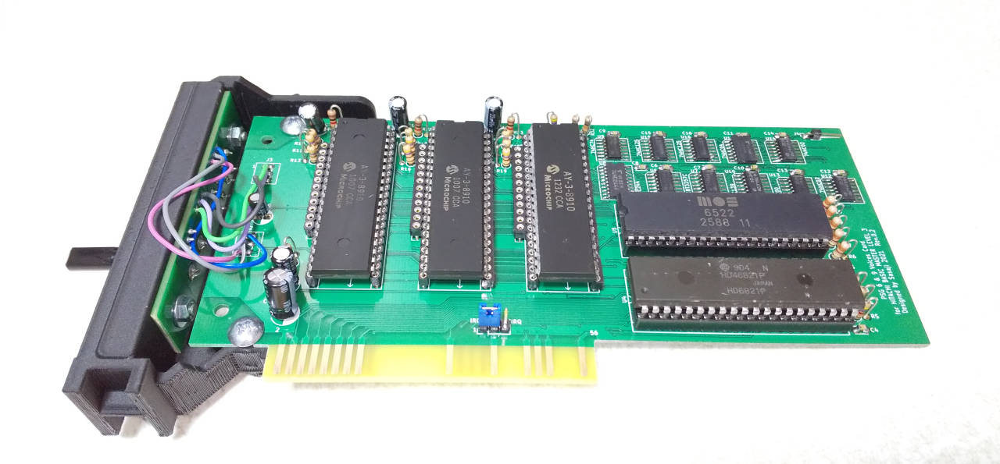

# PSG 6&9声カード for 日立ベーシックマスターレベル3

## フォルダ構成

    BackCover/ ..................... 背面カバーの3Dモデル
      L3BackSide2MJF-Resized.stl ... 背面カバーの3Dモデルファイル
      MegaZero2.0/ ................. Anycube MegaZero 2.0用
    Board/ ......................... 基板設計(KiCAD Version 5)
      main/ ........................ メイン基板
      side/ ........................ サブ基板(背面カバーに取り付ける基板)
      side_with_cover/ ............. 背面カバーを兼ねた基板

 * 3Dモデルから背面カバーを作ったときは、サブ基板を使用します。

-----
# PSG 6&9voices card for HITACHI BASIC MASTER LEVEL 3

## Folders:

    BackCover/ ..................... The 3D model of the back cover
      L3BackSide2MJF-Resized.stl ... The file of the back cover
      MegaZero2.0/ ................. For Anycube MegaZero 2.0
    Board/ ......................... Circuit board design(KiCAD Version 5)
      main/ ........................ The main board
      side/ ........................ The sub board (Attach to the back cover)
      side_with_cover/ ............. The side board which doubles as a back cover

 * When you made the back cover from 3D model, use the sub board.
